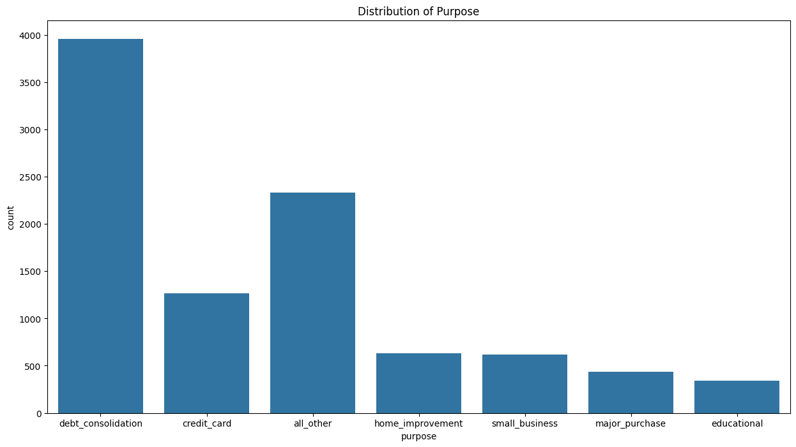

# Setup project

## Requirement packages

- [pandas](https://github.com/pandas-dev/pandas)
- [kfp](https://github.com/kubeflow/pipelines)
- [typing](https://github.com/python/cpython/blob/3.12/Lib/typing.py)
- [scikit-learn](https://github.com/scikit-learn/scikit-learn)
- [google-cloud-aiplatform](https://github.com/googleapis/python-aiplatform)
- [google-cloud-storage](https://github.com/googleapis/python-storage)
- [google-cloud-pipeline-components](https://github.com/kubeflow/pipelines/blob/master/components/google-cloud/LICENSE)

```
pip install pandas kfp typing scikit-learn google-cloud-aiplatform google-cloud-storage google-cloud-pipeline-components
```

## Setup project on GCP

Requirements component to setup project :

- Service Account
- Project ID
- Region
- Bucket

## EDA

### Requirement Packages

- [pandas](https://github.com/pandas-dev/pandas)
- [ydata-profiling](https://github.com/ydataai/ydata-profiling)
- [tensorflow](https://github.com/tensorflow/tensorflow)
- [numpy](https://github.com/numpy/numpy)
- [matplotlib](https://github.com/matplotlib/matplotlib)
- [seaborn](https://github.com/mwaskom/seaborn)

### Load data

The dataset has no empty data and has the following columns: :

- credit.policy
- purpose
- int.rate
- installment
- log.annual.inc
- dti
- fico
- days.with.cr.line
- revol.bal
- revol.util
- inq.last.6mths
- delinq.2yrs
- pub.rec
- not.fully.paid

### Check distribution Data

- **not.fully.paid**
  
  Mostly borrower fully paid and there is imbalanced data
- **purpose**
  
  
  
  Most borrowing purposes are for debt_consolidation
- **Not fully paid by status**
  
  
  More borrowers with small business goals do not repay the loan in full

- **Log Annual Income by Loan Purpose**

  
  
  On average, the top 3 borrowers are home improvement, small business, credit card. Small business is high income, but high risk not fully paid

- **Fico**
  
  
  
  Most borrowers have a good risk level. There are no borrowers with a poor level.

- **Fico by Loan Status**
  
  
  
  The fico score has quite an influence on whether the borrower will return the full amount or not. Judging from the fair level, it has the largest percentage of not returning the full loan. This percentage decreases based on the fico levels of good, very good, and exceptional.

- **Fico by Borrows purpose**
  
  
  
  Borrowers with educational goals are more at the fair level (the second highest number of those who do not repay the loan in full)

- **Fico by Loan Status**
  
  
  
  The fico score has quite an influence on whether the borrower will return the full amount or not. Judging from the fair level, it has the largest percentage of not returning the full loan. This percentage decreases based on the fico levels of good, very good, and exceptional.

## Preprocessing Data

Function :

- `preprocess_dataset_in_bq`

  Preprocess the data by encoding the purpose and fico columns, generate new columns named "purpose_encode" and "fico_encode", and create a table called "loan_data_preprocessed" to store the processed data.

  Package dependencies:

  - [google-cloud-bigquery](https://github.com/googleapis/python-bigquery)
  - [db-dtypes](https://github.com/googleapis/python-db-dtypes-pandas)

  Parameters :

  - project (str) : Project ID GCP
  - location (str) : Region GCP
  - dataset (str) : Name of dataset in BigQuery
  - table (str) : Name of table in BigQuery

  Return :
  The outcome of preprocessing data will yield "true" if successful and "false" if unsuccessful.

- `smote_dataset_store_in_bq`

  Resampling target data (not_fully_paid) with oversampling method, and save the result by replacing the loan_data_preprocessed table in BigQuery

  Package dependencies:

  - [google-cloud-bigquery](https://github.com/googleapis/python-bigquery)
  - [db-dtypes](https://github.com/googleapis/python-db-dtypes-pandas)
  - [pandas](https://github.com/pandas-dev/pandas)
  - [pandas-gbq](https://github.com/googleapis/python-bigquery-pandas)
  - [scikit-learn](https://github.com/scikit-learn/scikit-learn)

  Parameters :

  - project (str) : Project ID GCP
  - location (str) : Region GCP
  - dataset (str) : Name of dataset in BigQuery
  - table (str) : Name of table in BigQuery

  Return :
  The outcome of preprocessing data will yield "true" if successful and "false" if unsuccessful.

- `classification_model_eval_metrics`

  The `classification_model_eval_metrics` function evaluates a trained classification model's performance metrics and determines its suitability for deployment based on predefined thresholds.

  Dependencies

  - Base Image: gcr.io/deeplearning-platform-release/tf2-cpu.2-6:latest
  - Packages: [google-cloud-aiplatform](https://github.com/googleapis/python-aiplatform)

  Parameters :

  - project (str) : Project ID GCP
  - location (str) : Region GCP
  - thresholds_dict_str (str) : JSON string containing thresholds for model evaluation metrics
  - model: Input artifact representing the trained classification model.
  - metrics: Output artifact for general metrics logging.
  - metricsc: Output artifact for classification-specific metrics logging.
    Functions :

  - get_eval_info(model): Retrieves evaluation information for the model, including metrics and their values, and return evaluation name, metrics_list, and metrics_string_list
  - classification_thresholds_check(metrics_dict, thresholds_dict): yield true if the model's metrics meet predefined thresholds for deployment
  - log_metrics(metrics_list, metricsc): Logs various metrics and visualizations (ROC curve, confusion matrix) to the metricsc artifact.

  Return :

  Returns the deployment decision derived from the output of the classification_thresholds_check function.

- `pipeline`

  The `classification_model_eval_metrics` function evaluates a trained classification model's performance metrics and determines its suitability for deployment based on predefined thresholds.

  Parameters :

  - bq_source (str) : BigQuery source
  - DATASET_DISPLAY_NAME (str) : Dataset display name
  - TRAINING_DISPLAY_NAME (str) : Training display name
  - MODEL_DISPLAY_NAME (str) : Model display name
  - ENDPOINT_DISPLAY_NAME (str) : Endpoint display name
  - MACHINE_TYPE (str) : Type of machine
  - project (str) : Project id
  - gcp_region (str) : Region
  - thresholds_dict_str (str) : Threshold for deployment

  

## Run the Pipeline

Run the previously created pipeline by adding the following parameters:

- **display_name**: The name displayed in the AI Platform for this pipeline job.
- **template_path**: The path to the pipeline YAML file which defines the structure and components of the pipeline.
- **pipeline_root**: The root directory in Google Cloud Storage where the pipeline artifacts will be stored.
- **parameter_values**: A dictionary of parameters passed to the pipeline, which include:
  - **project**: The Google Cloud project ID where the pipeline will be executed.
  - **gcp_region**: The Google Cloud region where resources will be provisioned.
  - **bq_source**: The BigQuery source table or query used as input data for the pipeline.
  - **thresholds_dict_str**: A dictionary (in string format) specifying the threshold for model performance metrics (e.g., AUROC).
  - **DATASET_DISPLAY_NAME**: The display name for the dataset resource.
  - **TRAINING_DISPLAY_NAME**: The display name for the training job.
  - **MODEL_DISPLAY_NAME**: The display name for the model resource.
  - **ENDPOINT_DISPLAY_NAME**: The display name for the endpoint resource where the model will be deployed.
  - **MACHINE_TYPE**: The type of machine to be used for training and other operations.
- **enable_caching**: A boolean flag to disable caching of pipeline steps to ensure the pipeline runs from scratch each time.
